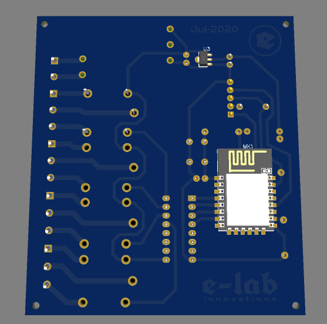
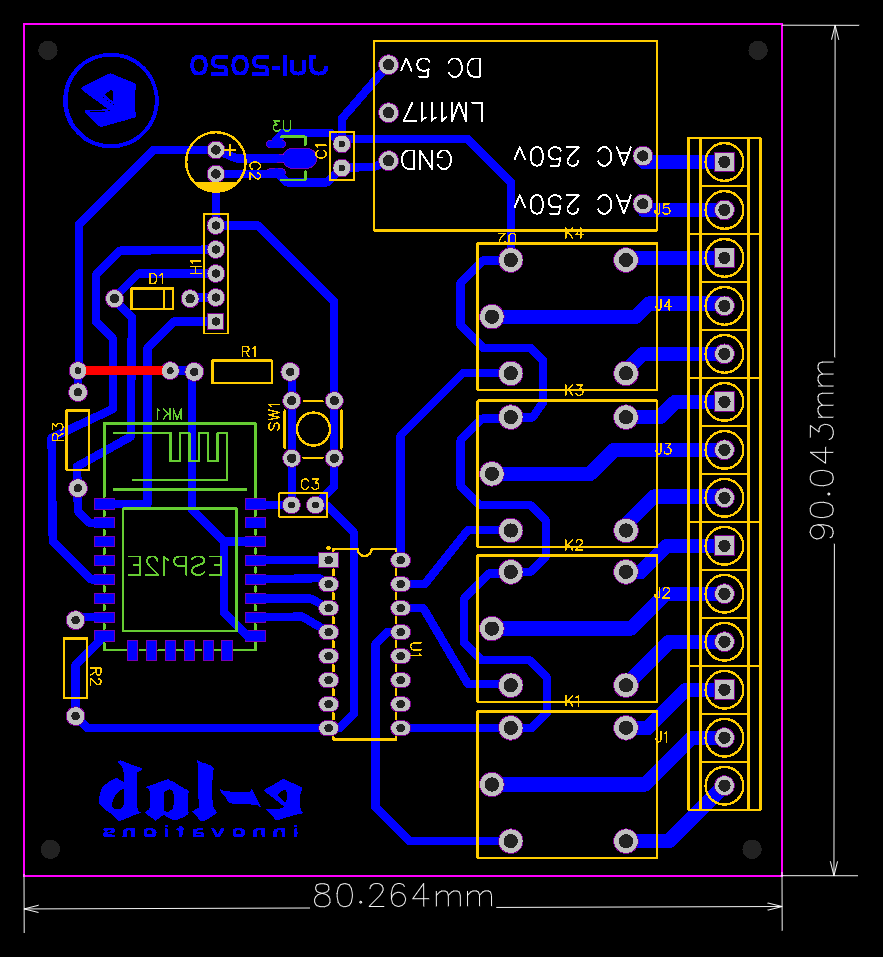
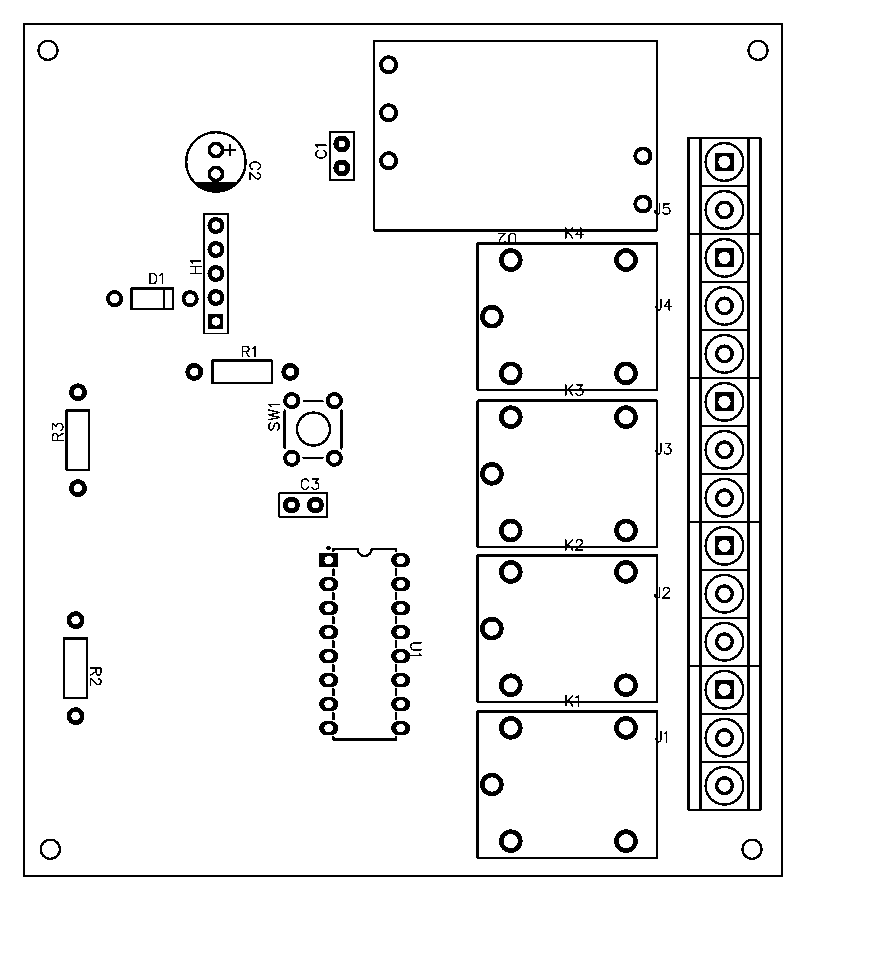
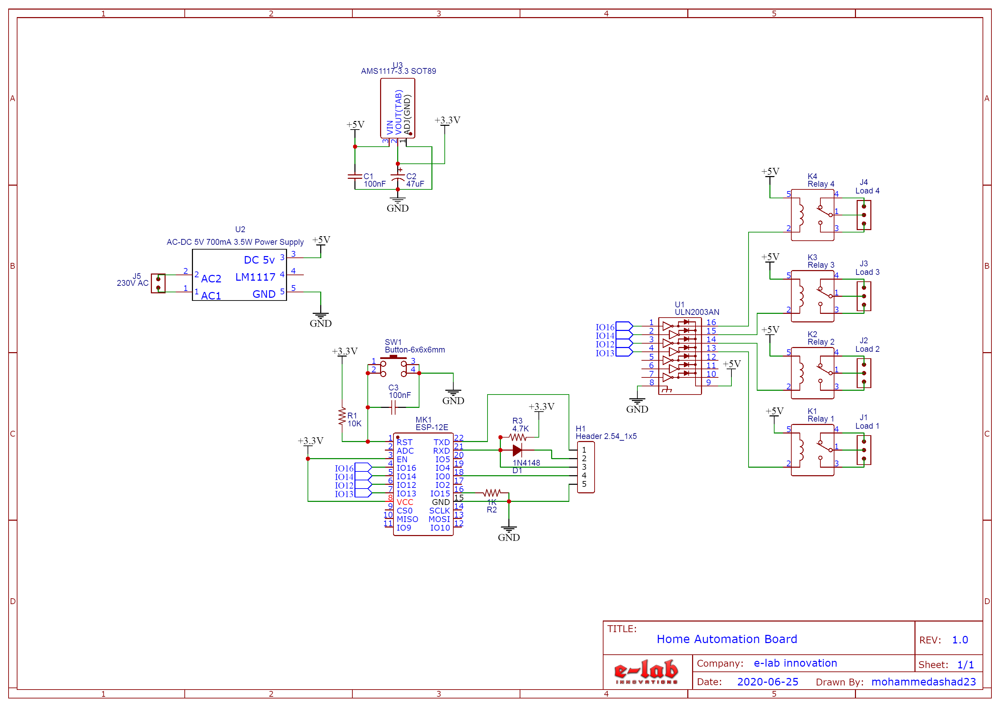

# ESP12 Based Home Automation

## Components
- R1- 10K
- R2- 1K
- R3- 4.7K
- K1, K2, K3 & K4 - 5V Relay
- C1-100nF (0.1uF)
- C2- 47uF
- C3- 100nF (0.1uF)
- D1- 1N4148
- U1- ULN2003
- U2- AC-DC 5V 700mA 3.5W Power Supply
- U3- AMS1117-3.3 SOT89
- SW- 6x6x6mm Push Button
- J1, J2, J3 & J4- 3 pin Screw Terminal Block
- J5- 5 pin Screw Terminal Block
- H1- 1x5 Male header pin
- MK1- ESP12E